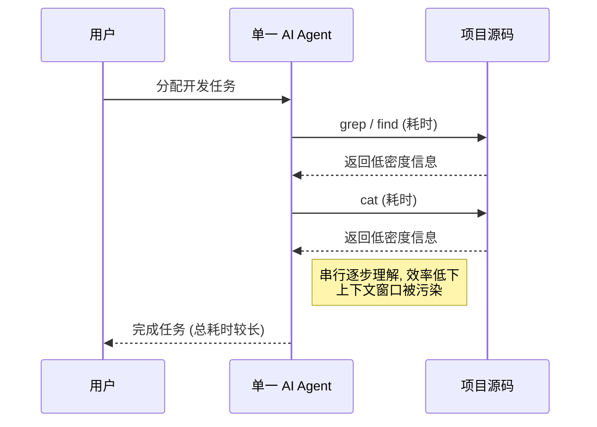
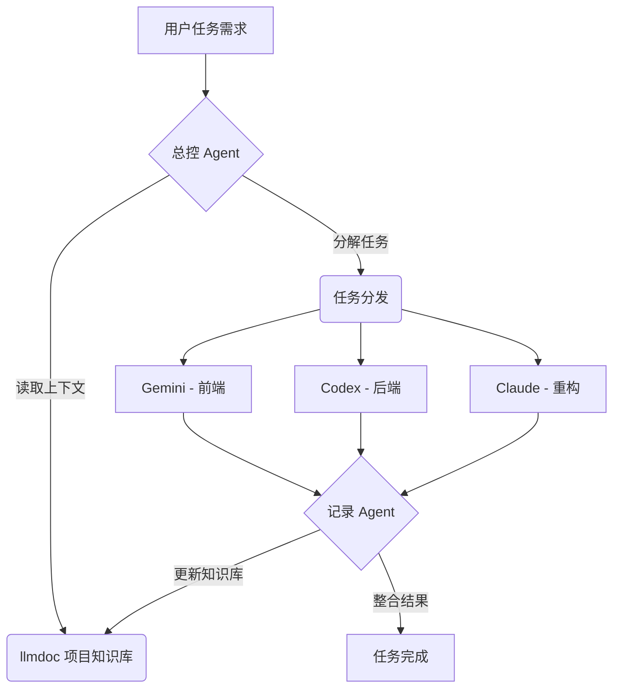

# AI 辅助开发：标准化可复用的团队 Agent 工作流方案

## 摘要

为了解决当前 AI 辅助编码中存在的瓶颈问题，我们设计了一套标准化的、可复用的、团队协同的 Agent 工作流。本方案旨在解决 AI 不懂业务上下文、多轮对话中信息密度低导致性能下降、任务串行执行效率低下，以及团队知识资产无法有效沉淀和复用等核心痛点。

我们提出的新工作流，通过**自动化文档（`llmdoc`）维护**、**子 Agent 驱动的 RAG** 以及**多 CLI 协同编排**，构建一个高效、可扩展的智能化开发新范式。该体系不仅能显著提升 AI 对项目的理解深度和任务执行效果，更能将个人的实践经验转化为可复用的团队资产，从而实现开发生产力的大幅跃升。

---

## 1. AI 辅助编码的核心痛点

尽管 AI Agent 展示了巨大的潜力，但在企业级的软件开发实践中，我们仍面临以下几个显著的挑战：

### 1.1. AI 不懂业务：上下文理解成本高
AI Agent 在执行任务前，必须通过阅读大量源码来理解项目背景和业务逻辑。对于逻辑复杂的项目，这个过程极为耗时且效率低下。

### 1.2. 多轮对话“变笨”：上下文信息密度低
Agent 通常依赖一连串的 `find`、`grep`、`cat` 等基础命令来探索代码。这种方式向模型输入的上下文信息密度极低，充斥着大量碎片化信息。随着对话轮次的增加，模型性能会显著下降，出现“越问越笨”的现象。

#### **当前低效的串行工作流**

### 1.3. 任务串行执行：效率的瓶颈
绝大多数 AI 交互是单线程的，这构成了严重的效率瓶颈。单个 Agent 无法同时处理多个独立的模块或任务。在复杂需求下，这会导致开发时间呈线性乃至指数级增长。

### 1.4. 工具/模型单一：能力受限
依赖单一的工具或模型存在明显短板。不同的模型在不同任务上各有千秋（例如，代码生成、重构、Bug 修复、前端开发等）。“一刀切”的方案无法在所有场景下都获得最优的生成效果，影响了最终的产出质量。

### 1.5. 缺少团队资产沉淀与复用
高效的 Agent 使用技巧，例如高质量的 Prompt、Skills 定义、上下文管理策略等，往往停留在个人经验层面，缺乏标准化的工作流程来沉淀和推广。这使得个人的智慧结晶无法转化为团队可复用的宝贵资产。

---

## 2. 我们的解决方案：标准化的四阶段协同工作流

为了克服上述挑战，我们提出一套多维度、团队协同的解决方案。该方案将 Agent 的工作流程标准化为清晰的四个阶段，其核心逻辑如下图所示：

#### **高效的并行协同工作流**

我们的工作流通过以下四个阶段实现高效、智能的开发：

### 第一阶段：任务理解与规划
当接收到一个新的开发任务时，**总控 Agent** (Orchestrator) 首先会读取项目专属的 **`llmdoc` 知识库**。这份高密度的上下文让 Agent 能在瞬间理解项目架构、业务逻辑和编码规范，避免了耗时的源码学习。基于这份深刻理解，总控 Agent 会对复杂任务进行智能分解，规划出清晰的执行步骤。

### 第二阶段：并行执行与专业分工
任务分解后，总控 Agent 会将不同的子任务分发给最适合的**专业 CLI Agent**，并通过 **多 CLI 协作框架**让它们并行执行。例如：
- **前端开发**任务交给精通 UI 框架的 **Gemini**。
- **后端逻辑**与数据库任务交给擅长逻辑和数据处理的 **Codex**。
- **复杂重构**或架构调整任务交给具备强大长上下文理解能力的 **Claude**。
这种模式打破了单线程瓶颈，实现了效率的最大化。

### 第三阶段：结果整合与记录
在各个专业 Agent 完成自己的子任务后，一个专职的 **记录 Agent** 会被触发。它的核心职责是：
1. **整合产出**：将所有并行的开发结果进行汇总和合并。
2. **记录过程**：使用 **subAgent RAG** 技术，自动记录本次任务的关键决策、代码变更和最终实现，形成结构化的“行动报告”。

### 第四阶段：知识闭环与沉淀
这是我们工作流实现自我进化的关键。记录 Agent 将上一阶段生成的“行动报告”进行处理，并**反向更新到 `llmdoc` 项目知识库**中。这意味着：
- 每一次开发任务都在为团队沉淀新的知识资产。
- AI Agent 的下一次工作将基于更丰富、更准确的上下文，从而变得越来越智能。

通过这四个阶段的循环，我们不仅高效地完成了当下的开发任务，更构建了一个能够持续学习、不断积累团队智慧的“活”系统。
